# Irish Sea Analysis

### Data Science Case: Performing Time Series Prediction

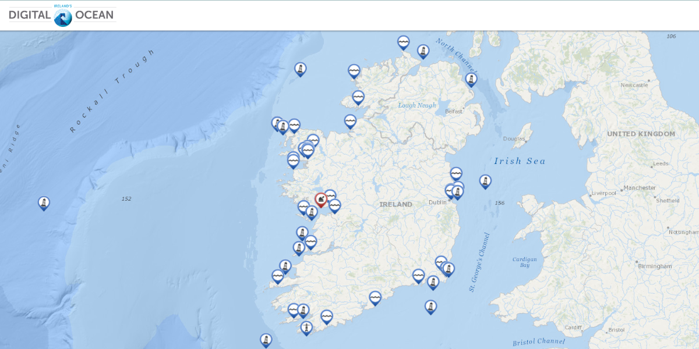

## 1. Abstract

This Data Science Case was proposed by [Dadosfera](https://dadosfera.ai/) in its selection process for the vacancy of Data Scientist. Its main objective is to verify the candidate's proficiency in tools such as: SQL, Python and Cloud Computing.

For this, a data project was developed based on the last year information available on the [DigitalOcean.ie](https://www.digitalocean.ie/Home/About) portal, which gathers data from various sources on Ireland’s maritime zone.

The aims of the project were divided in two parts:

 * **Part 1:** Answer the following questions about the Irish sea. Click [here](https://github.com/vitorhmf/irish-sea#46-exploratory-data-analysis) to go to Part 1.
     - Q1: What is the lowest temperature of each one of the Bouys? Which usually month it occurs?
     - Q2: Where (lat/long) do we have the biggest water level? Which usually month it occurs?
     - Q3: How the Wave Lenghts correlates with Sea Temperature? It is possible to predict with accuracy the Wave Lenght, based on the Sea Temperature and the Bouy location?
     
 * **Part 2:** Development of a Regression Model applied to time series to predict the sea temperature throughout the year. Click [here](https://github.com/vitorhmf/irish-sea#6-machine-learning-modeling) to go to Part 2.

## 2. Data Pipeline

The CRISP-DM data pipeline was the guide for this data science project development. 

CRISP-DM, which stands for Cross-Industry Standard Process for Data Mining, is an industry-proven way to guide your data mining efforts and it includes descriptions of the typical phases of a project, the tasks involved with each phase, and an explanation of the relationships between these tasks.

**Source:* [IBM Docs](https://www.ibm.com/docs/en/spss-modeler/18.2.0?topic=dm-crisp-help-overview)

To direct your reading, below are links to the development carried out at each stage of the CRISP cycle:

* [Business Understanding](https://github.com/vitorhmf/irish-sea#3-business-understanding)
* [Data Understanding](https://github.com/vitorhmf/irish-sea#4-data-understanding)
* [Data Preparation](https://github.com/vitorhmf/irish-sea#5-data-preparation)
* [Machine Learning Modeling](https://github.com/vitorhmf/irish-sea#6-machine-learning-modeling)
* [Evaluation](https://github.com/vitorhmf/irish-sea#7-evaluation)
* [Depoyment](https://github.com/vitorhmf/irish-sea#8-deployment)

## 3. Business Understanding

[DigitalOcean.ie](https://www.digitalocean.ie/Home/About) is a portal to data collected in and around Ireland’s maritime zone. It collects together data and information provided by a number of organizations into one place.

From this portal two datasets were used in this project and collected in the period from **09/01/2021 at 00:00 to 08/31/2022 at 23:59**.

### 3.1 Tide Data

This dataset was used to collect information about the water level. It is avalable [here](https://www.digitalocean.ie/Data/DownloadTideData) and contains the following features:

| Feature                    | Definition
|----------------------------|---------------------------------------------------------------|
| time                       | Datetime when the row was registred                           |                               
| station_id                 | Station Name                                                  |       
| longitude                  | Geolocation                                                   |                                                           
| latitude                   | Geolocation                                                   |  
| water_level_LAT            | Water level measured by LAT (lowest astronomical tide)        |                                               
| water_level_OD_Malin       | Water level measured by OD Malin                              |   
| qc_flag                    | Quality Control Flag                                          |    

* [Reference: OD Malin](https://en.wikipedia.org/wiki/Ordnance_datum)
* [Reference: LAT](https://en.wikipedia.org/wiki/Chart_datum)

### 3.2 Wave Data

From this dataset was developed analysis about temperature and wave height. It is avalable [here](https://www.digitalocean.ie/Data/DownloadTideData) and contains the following features:

| Feature                    | Definition
|----------------------------|---------------------------------------------------------------|
| longitude                  | Geolocation                                                   |                                   
| latitude                   | Geolocation                                                   |       
| time                       | Datetime when the row was registred                           |                               
| station_id                 | Station Name                                                  |       
| peak_period                | Time (in seconds) that the wave remained at the peak          |                                               
| peak_direction             | object                                                        |   
| upcross_period             | Time (in seconds)                                             |               
| significant_wave_height    | Wave Height (in cm)                                           |               
| hmax                       | Height máx (in cm)                                            |               
| sea_temperature            | Temperature em celcius degree                                 |                           
| mean_cur_speed             | Wave Speed (in m/s)                                           |               
| mean_cur_dir_to            | object                                                        | 

[Back to the top](https://github.com/vitorhmf/irish-sea#2-data-pipeline)

## 4. Data Understanding

### 4.1. Data Overview

To build an overview of the data, the following steps were performed:
* Change the columns name to sneak_case;
* Shows the data dimensions (rows and columns);
* Understand the description of each feature;
* Check and Fillout NA:
  - **Tide Data:** this dataset presents two ways to measure the water level: by LAT and by OD Malin. The LAT had 14% missing values and as the OD Malin was complete I decided to eliminate the LAT column;
  - **Wave Data:** Two collection stations did not present information in the defined period; Three stations had no values in the hmax, mean_cur_speed and mean_cur_dir_to columns, so these 3 columns were dropped. Finally, the missing values that remained were due to the difference between the information collection periods in which case the remaining NAs were removed.
* Change Types;

### 4.2 Basic Description of Data: 

A quick descriptive analysis of the numerical and categorical variables was performed to assist in the prior understanding of the data.
 
**Numerical Attributes:**

At this stage, the point of attention is only the range of the peack_direction, wave_height and water_level features that can indicate the presence of outliers.

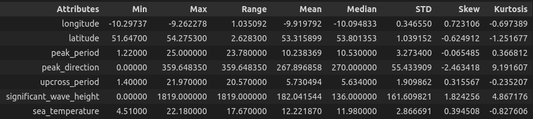

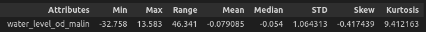

**Categorical Attributes:**

Numbers of records per collection station:

* Water Temperature:
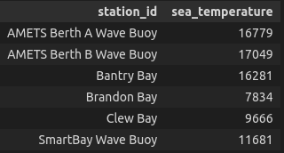

* Water Level:
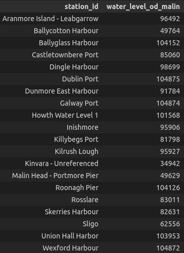

### 4.3 Feature Engineering

* Time-derived features: date, year, month, year_month, day_of_month, day_of_week, hour

### 4.4 Data Filtering

To analyze and filter outliers that may impact the data analysis, the sea level variation per month and per buoy point was initially verified. In this analysis, a discrepancy of values in the month of August is concluded, occurring punctually in the buoy of the Portmore Pier

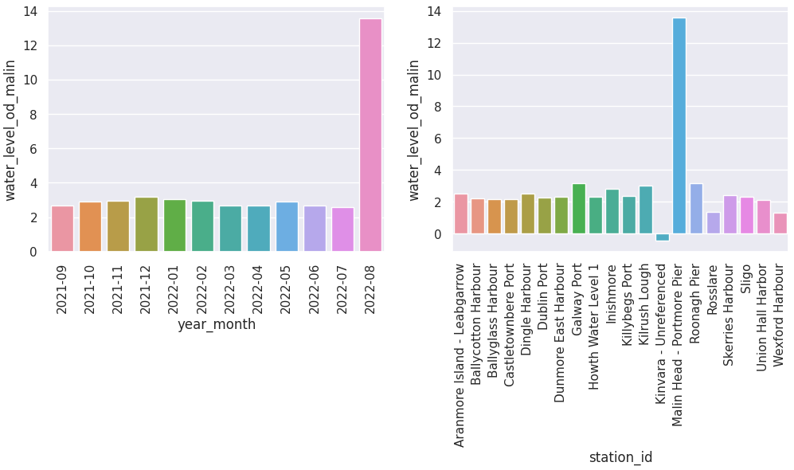

Analyzing the Portmore Pier in-depth, we can see that it was about 5 months without registering information and when it returned in August it presented values that were very different from the history. Because of this fact, the records for the month of August at Portmore Pier were filtered from the dataset.

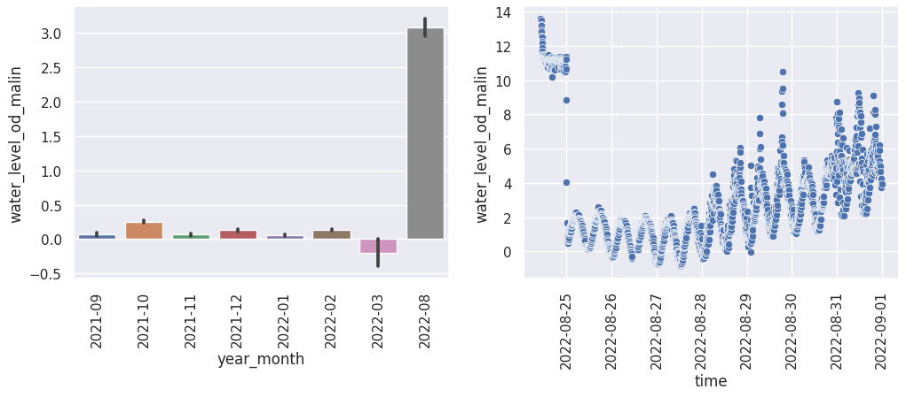

### 4.5 Exploratory Data Analysis

In this project, the EDA was developed with the main objective of answering the questions presented in the case.

#### Question 1: What is the lowest temperature of each one of the Bouys? Which usually month it occurs?

The graph below shows the lowest temperatures (ºC) recorded in each buoy. Throughout the year, the lowest temperatures are normally recorded between the months of January and March.

#### Question 2: Where (lat/long) do we have the biggest water level? Which usually month it occurs?

The graph below shows the highest sea levels (meters) recorded in the buoys that had the highest records. Throughout the year, the Irish Sea reaches its highest levels between the months of December and February.

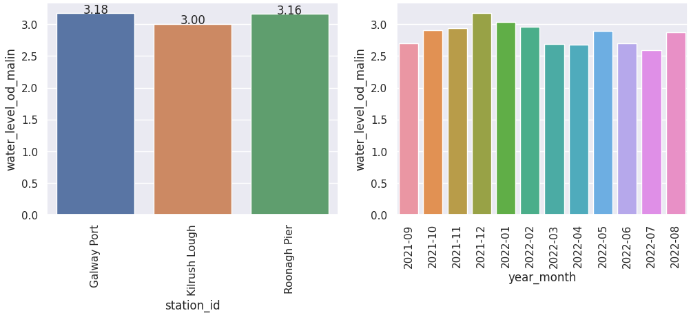
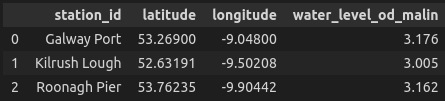

#### Question 3: How the Wave Lenghts correlates with Sea Temperature? It is possible to predict with accuracy the Wave Lenght, based on the Sea Temperature and the Bouy location?

The correlation between Wave Length and Sea Temperature is negative, which means that with a lower temperature, there is a tendency to form larger waves. However, by Pearson's method, this correlation presented a low index, indicating that the sea temperature does not have a very relevant impact on the size of its waves (it can be observed too in the scatter plot).

This indicates that using only this feature and the buoy position, it would not be possible to build a predictive model with high accuracy.

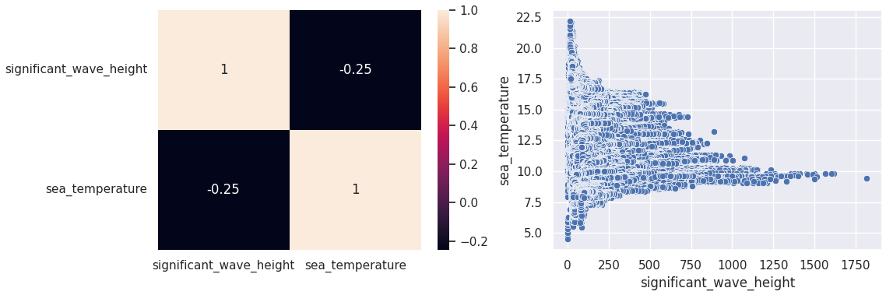

[Back to the top](https://github.com/vitorhmf/irish-sea#2-data-pipeline)

## 5. Data Preparation

### 5.1 Feature Transformation:

* **Standarditazion:** not used because none of the variables showed a normal curve;
* **Rescaling:**
     - MinMax Scaler: peak_period, upcross_period, year;
     - Robust Scaler: peak_direction, significant_wave_height;
* **Encoding:** applied to the categorical variable station_id
* **Nature Transformation:** for cyclic variables (month, day of month, week of year, day of week and hour) the sine and cosine transformation was applied

### 5.2 Feature Selection: 

In the first version of the model, the Boruta algorithm was used to indicate the relevant variables. By this method all dataset variables were selected.

**Note:** thinking about a practical application for the predictive model, where users would only have information about the date, time and place where they would like to see the temperature forecast, a new model was built using only these features

[Back to the top](https://github.com/vitorhmf/irish-sea#2-data-pipeline)

## 6. Machine Learning Modeling

For the construction of the regression model, linear and non-linear regression algorithms were tested:
* Linegar Regression: Linear Regression Model and Linear Regression Regularized Model (Lasso).
* Nonlinear Regressions: Random Forest Regressor and XGBoost Regressor.

And to evaluate the performance of each model, the following error metrics were used:
* MAE: Mean Absolute Error
* MAPE: Mean Absolute Percentage Error
* RSME: Root Mean Square Error

### 6.1 All Features

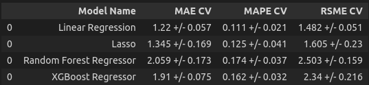

*Results with Cross Validation (CV)*

### 6.1 Time Features

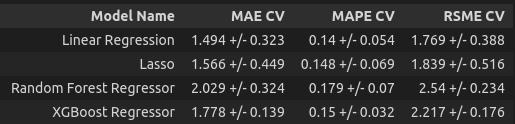

*Results with Cross Validation (CV)*

[Back to the top](https://github.com/vitorhmf/irish-sea#2-data-pipeline)

## 7. Evaluation

For the final evaluation of the model, we will proceed with the version in which only the date, time and location variables are used and we will use the linear regression model algorithm.

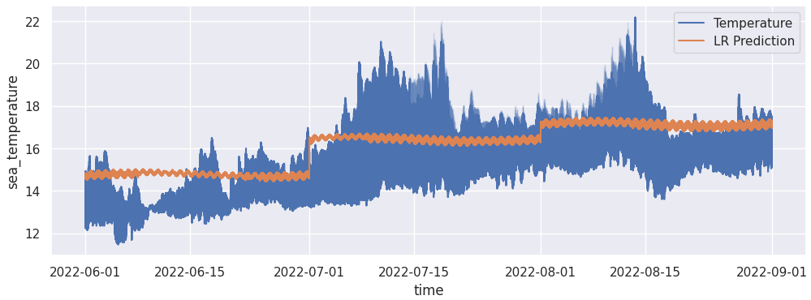

Comparing the temperature records present in the validation dataset with the values predicted by the linear regression model, it is clear that this is not a very accurate result and that, depending on the practical application of this model, it will be necessary to improve this modeling.

[Here](https://github.com/vitorhmf/irish-sea/blob/main/notebook/wave_analysis_v02.ipynb) you can check the complete code.

[Back to the top](https://github.com/vitorhmf/irish-sea#2-data-pipeline)

## 8. Deployment

* **S3:** used to save the datasets collected in the portal
* **RDS:** used to create and store the Irish-sea Database, where the collected information was organised.

[Back to the top](https://github.com/vitorhmf/irish-sea#2-data-pipeline)

## 9. Conclusion

### 9.1. Business Results

As the case was not applied to a specific business, it would be necessary to deepen the discussion to find out what return an analysis like this could bring.

### 9.2. Next Steps

* Improve model results 
* Search for an API to collect data in the portal
* Develop a deployment to query the temperature forecast. For example, a telegram bot guiding fishermen about sea temperature.

[Back to the top](https://github.com/vitorhmf/irish-sea#2-data-pipeline)

## 10. References

[Back to the top](https://github.com/vitorhmf/irish-sea#2-data-pipeline)

